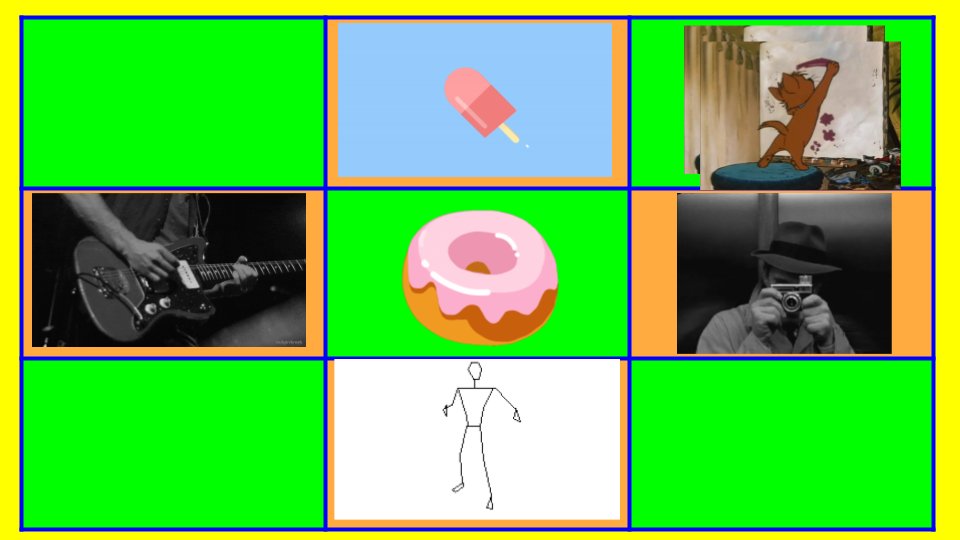

# wiehack2.0
## Community Interaction Application

Communities are a very important part of who we become in both personal and professional space. The people we interact with, the way we interact and how comfortable we are in a community determines how much we make out of it, and it also determines how effective community’s activities are.

With inclusion being a priority, the comfort level is very important to achieve. This applies to every level of community development and building. Whether it’s a tech community, activities at school, or sessions in the professional space.

I have observed the struggle to get all the members to interact with each other. Usually different games to get the participants to interact with one another are played. This involves preparation beforehand and work for volunteers during the interaction. I feel this interaction is a very important tool in any community to make sure everyone makes the most of the activities and resources that the community has to offer.

Hence I am proposing an AR based app which helps the participants get involved in the
community without the organizer hassle.

## Using AR

Everywhere today, we are being taught to question concepts, observe the minute
details and look through the big picture and understand the nuances. AR/VR are a true
gift in this sense. As they help us see through and look for details.

More than this AR is fun! It has potential to add a fun factor to everything it is
integrated with.

## Progress:

- Have researched all the different technologies that can are available and can be used to create a quality oriented AR application.
- Read and understood the difference between open source and paid tools and their limitations.
- Installed the necessary chosen softwares that can help me develop the proposed solution.
- Have been looking for and trying out demos, to compare and study different integrations available.
- I have added to this repository all the different demos, that I am trying and modifying. 
- All the above demos are under the MIT license and can be used to speed up the development process.

## Wireframes and Mockups

- The Bingo grid

